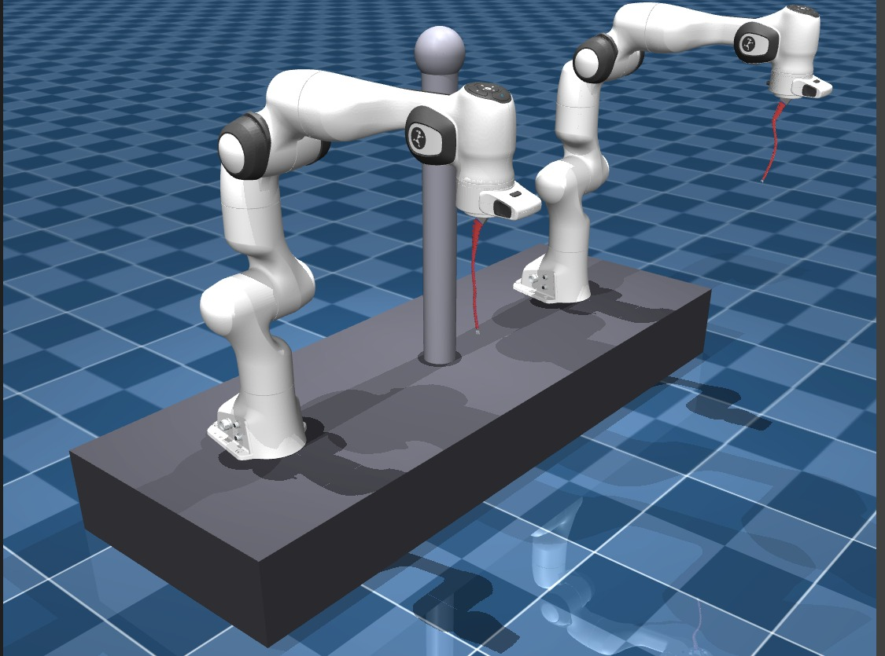
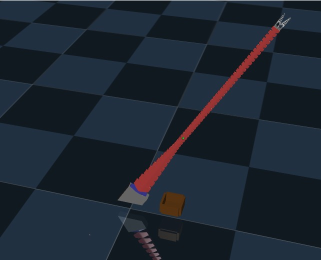

# Dual Arm Robotic Assistance System for Laparoscopic Surgery

A MuJoCo-based simulation framework combining **two Franka Emika Panda arms** with a **Tendon-Driven Continuum Robot (TDCR)** for laparoscopic surgical assistance. The system supports inverse kinematics, teleoperation, gripper control, and multi-scale TDCR configurations.

---



---



---

## Project Structure

```
Dual_Arm_Robotic_Assistance_System_for_Laparoscopic_Surgery/
│
├── two_pandas_tdcr_scale0.1.xml          # Full dual-Panda + TDCR scene (scale 0.10)
├── two_pandas_tdcr_scale0.125.xml        # Full dual-Panda + TDCR scene (scale 0.125)
├── two_pandas_tdcr_scale0.15.xml         # Full dual-Panda + TDCR scene (scale 0.15)
├── two_pandas_tdcr_scale0.25.xml         # Full dual-Panda + TDCR scene (scale 0.25)
├── two_pandas_tdcr_scale0.4.xml          # Full dual-Panda + TDCR scene (scale 0.40)
│
└── franka_ik/
    ├── description/                      # Robot model definitions (XML + STL meshes)
    │   ├── 3D/                           # TDCR base STL meshes
    │   ├── 3D_Gripper/                   # Gripper STL meshes
    │   ├── franka_emika_panda/           # Franka Panda MJCF/XML models & scenes
    │   │   ├── panda.xml                 # Standard Panda model
    │   │   ├── panda2.xml                # Second Panda instance (for dual-arm)
    │   │   ├── scene.xml                 # Minimal single Panda scene
    │   │   ├── scene_2frankas.xml        # Dual Panda scene (no TDCR)
    │   │   ├── scene_1frank_tdcr50S.xml  # Single Panda + TDCR 50-seg Same scene
    │   │   ├── scene_fankcont24.xml      # Franka + TDCR 24-seg scene
    │   │   ├── scene_fankcont50S.xml     # Franka + TDCR 50-seg Same scene
    │   │   └── scene_fankcont50T.xml     # Franka + TDCR 50-seg Tapering scene
    │   ├── Long_Manipulator.xml          # Base TDCR (no gripper)
    │   ├── Long_Manipulator24+Gripper.xml     # TDCR 24-seg + gripper
    │   ├── Long_Manipulator50S+Gripper.xml    # TDCR 50-seg Same + gripper
    │   ├── Long_Manipulator50T+Gripper.xml    # TDCR 50-seg Tapering + gripper
    │   └── tool.xml                      # Tool attachment definition
    │
    ├── scripts/                          # Runnable Python simulations
    │   ├── dls-ik.py                     # DLS IK: single Franka to a fixed target point
    │   ├── ik_franka_tdcr.py             # Teleoperation: Franka IK + TDCR 50-seg Same
    │   ├── load_franka.py                # Loads a single Franka arm
    │   ├── load_tool.py                  # Loads tool attachment only
    │   ├── load_two_frnk.py              # Loads both Franka arms (dual-arm setup)
    │   ├── Long_Manipulator_Control.py   # Keyboard control of TDCR (no gripper)
    │   ├── Long_Manipulator_Control+Gripper.py  # Keyboard control of TDCR + gripper
    │   ├── MSpace.py                     # Muscle/configuration space utilities
    │   └── scale_tdcr.py                 # Generates scaled TDCR XMLs with dual Pandas
    │
    └── utils/                            # Core utility modules
        ├── dls_velocity_control/         # Damped Least Squares velocity IK solver
        ├── mj_scene_construction/        # MuJoCo scene builder helpers
        ├── mj_velocity_control/          # MuJoCo velocity controller
        └── quaternion_math/              # Quaternion utilities for orientation math
```

---

## Naming Conventions

| Tag | Meaning |
|-----|---------|
| **T** | **Tapering** TDCR — tube/segment diameter tapers along the length |
| **S** | **Same** TDCR — uniform segment diameter throughout |
| **50** | 50-segment TDCR discretization |
| **24** | 24-segment TDCR discretization |

---

## Scripts — What Each File Does

### `dls-ik.py`
Moves a **single Franka Panda** to a **hardcoded target position** using Damped Least Squares (DLS) inverse kinematics. No interactivity — the arm converges to the point specified in the code. Good for testing IK convergence and validating joint limits.

**Run:** `python dls-ik.py`

---

### `ik_franka_tdcr.py`
**Main teleoperation script.** Loads a scene with one Franka Panda and the **50-segment Same (50S) TDCR**. The Franka is controlled via keyboard-driven DLS velocity IK, and the TDCR is controlled via tendon actuators and a gripper. Full combined system interaction.

**Run:** `python ik_franka_tdcr.py`

**Controls:**

| Key | Action |
|-----|--------|
| `↑` / `↓` | Move Franka target **+Y / −Y** |
| `←` / `→` | Move Franka target **+X / −X** |
| `W` / `S` | Move Franka target **+Z / −Z** |
| `R` | Reset target to initial end-effector position |
| `K` | Activate TDCR tendon **t1** (bend direction 1) |
| `L` | Activate TDCR tendon **t2** (bend direction 2) |
| `Z` | **Close** gripper (increase activation) |
| `C` | **Open** gripper (decrease activation) |
| `X` | **Auto-grasp pulse** (close then release) |

---

### `load_franka.py`
Loads a **single Franka Panda** in MuJoCo for visualization or basic testing. No IK, no TDCR.

**Run:** `python load_franka.py`

---

### `load_tool.py`
Loads only the **tool attachment** XML (`tool.xml`) for inspection or debugging the end-effector geometry.

**Run:** `python load_tool.py`

---

### `load_two_frnk.py`
Loads the **complete dual-arm setup** — both Franka Pandas together (`scene_2frankas.xml`). Used to verify the dual-arm configuration, joint ranges, and scene layout without any TDCR attached.

**Run:** `python load_two_frnk.py`

---

### `Long_Manipulator_Control.py`
Keyboard teleoperation of the **TDCR alone** (no Franka, no gripper). Uses `Long_Manipulator.xml`. Lets you test TDCR bending behavior in isolation using tendon actuator keys.

**Run:** `python Long_Manipulator_Control.py`

---

### `Long_Manipulator_Control+Gripper.py`
Keyboard teleoperation of the **TDCR with a gripper attached**. Extends `Long_Manipulator_Control.py` with gripper open/close/pulse controls. Uses `Long_Manipulator50S+Gripper.xml` or equivalent.

**Run:** `python Long_Manipulator_Control+Gripper.py`

---

### `MSpace.py`
Utility/helper for muscle space and configuration space operations. Used internally by other scripts for actuator mapping and tendon activation calculations.

---

### `scale_tdcr.py`
Generates the **root-level XML files** (`two_pandas_tdcr_scale*.xml`) by programmatically constructing a scene with **two Franka Pandas** attached to a **scaled TDCR**. Run this script with a desired scale factor to regenerate or create new scale variants.

**Run:** `python scale_tdcr.py`  
**Output:** `two_pandas_tdcr_scale<factor>.xml` in the project root

---

## Scene XML Files (Key Descriptions)

| File | Description |
|------|-------------|
| `scene.xml` | Minimal single Panda, no TDCR |
| `scene_2frankas.xml` | Both Pandas loaded together |
| `scene_1frank_tdcr50S.xml` | One Panda + 50-seg Same TDCR |
| `scene_fankcont24.xml` | Panda + 24-seg TDCR (continuity test scene) |
| `scene_fankcont50S.xml` | Panda + 50-seg Same TDCR (full scene) |
| `scene_fankcont50T.xml` | Panda + 50-seg Tapering TDCR (full scene) |
| `two_pandas_tdcr_scale0.1.xml` | Dual Pandas + TDCR at scale 0.10 |
| `two_pandas_tdcr_scale0.125.xml` | Dual Pandas + TDCR at scale 0.125 |
| `two_pandas_tdcr_scale0.15.xml` | Dual Pandas + TDCR at scale 0.15 |
| `two_pandas_tdcr_scale0.25.xml` | Dual Pandas + TDCR at scale 0.25 |
| `two_pandas_tdcr_scale0.4.xml` | Dual Pandas + TDCR at scale 0.40 |

---

## TDCR Model Files

| File | Description |
|------|-------------|
| `Long_Manipulator.xml` | Base TDCR body, no gripper |
| `Long_Manipulator24+Gripper.xml` | 24-segment TDCR with gripper |
| `Long_Manipulator50S+Gripper.xml` | 50-seg Same TDCR with gripper |
| `Long_Manipulator50T+Gripper.xml` | 50-seg Tapering TDCR with gripper |

---

## Utility Modules (`franka_ik/utils/`)

| Module | Description |
|--------|-------------|
| `dls_velocity_control/` | Damped Least Squares IK solver — computes joint velocities from Cartesian error |
| `mj_scene_construction/` | Helpers for programmatically building/modifying MuJoCo XML scenes |
| `mj_velocity_control/` | MuJoCo velocity controller wrappers |
| `quaternion_math/` | Quaternion operations for end-effector orientation tracking and error computation |

---

## 3D Mesh Assets

### `description/3D/` — TDCR Base Meshes
- `P_0Base.STL` — Base platform of the TDCR
- `P_1.STL`, `P_1_3.STL` — Segment link geometries
- `p_platform.STL` — Mounting platform

### `description/3D_Gripper/` — Gripper Meshes
- `gripper_base.STL` — Gripper mount
- `middle_part.STL` — Intermediate gripper linkage
- `gripper.STL` — Gripper jaw geometry

---

## Dependencies

- [MuJoCo](https://github.com/google-deepmind/mujoco) — Physics simulation
- `mujoco` Python bindings
- `pynput` — Keyboard teleoperation input
- `numpy` — Numerical computation

---

## Quick Start

```bash
# Clone and navigate
cd Dual_Arm_Robotic_Assistance_System_for_Laparoscopic_Surgery/franka_ik/scripts

# Single Franka IK to fixed point
python dls-ik.py

# Load dual Franka setup
python load_two_frnk.py

# Full teleoperation: Franka + TDCR + Gripper
python ik_franka_tdcr.py

# TDCR-only keyboard control (with gripper)
python Long_Manipulator_Control+Gripper.py

# Generate new scaled dual-arm TDCR XML
python scale_tdcr.py
```